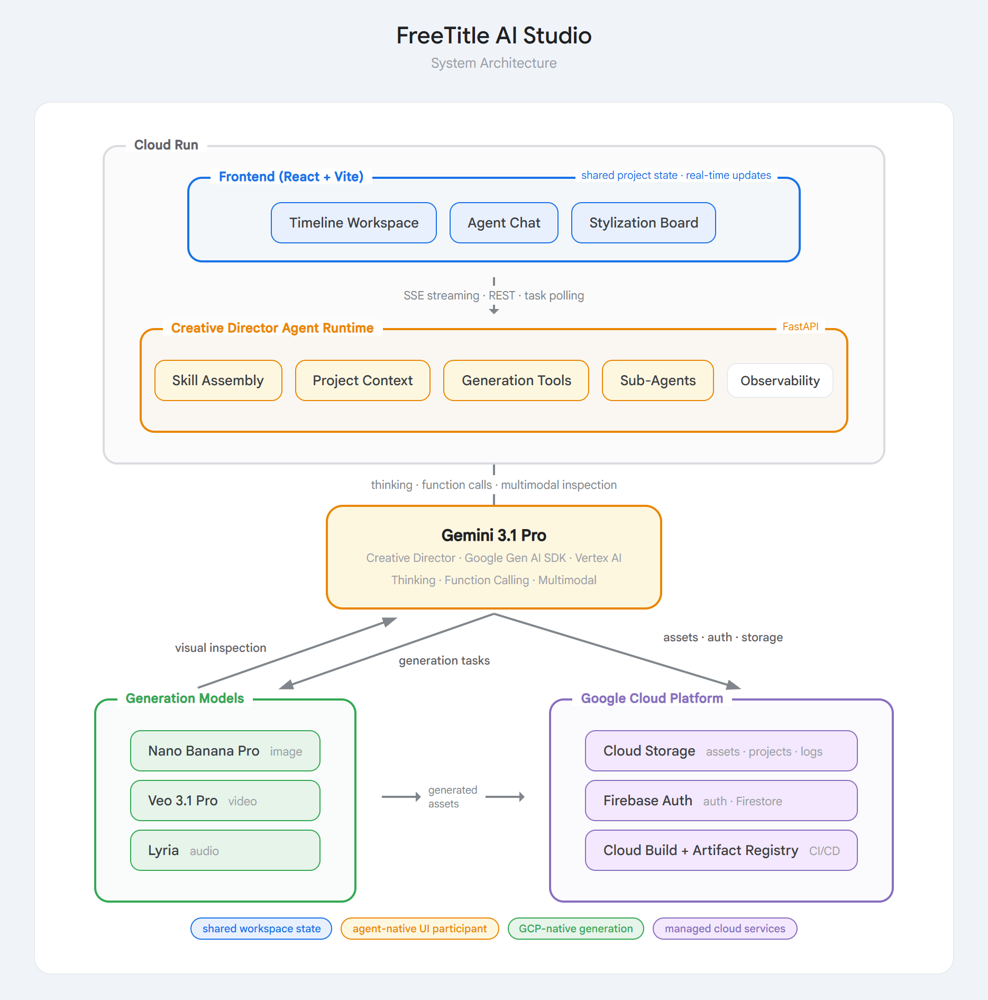

<h1 align="center">FreeTitle: The Creative Director for AI Video Production</h1>

<p align="center">
  <em>Gemini Live Agent Challenge -- Creative Storyteller Track</em>
</p>

---

## What It Does

FreeTitle is a Gemini-powered creative director that handles video production end to end -- interpreting creative intent, developing scripts, characters, and visual worlds, generating storyboard frames and clips, and editing launch-ready cinematic video. It runs autonomously or collaborates in real time: users can let it work or step in at any point to redirect and co-create.

The agent works inside a timeline-based workspace alongside the user -- not behind a black-box pipeline. It assembles creative knowledge dynamically, manages sub-agents, inspects its own outputs multimodally, and iterates within the same conversational loop.

## Models

- **Gemini 3.1 Pro** -- Creative direction, planning, tool use, multimodal inspection
- **Gemini 3 Pro Image** -- Characters, storyboard frames, environments, cinematic assets
- **Veo 3.1** -- Video generation from storyboard frames
- **Lyria** -- Background music generation

---

## Architecture

<p align="center">
  
</p>

---

## Quick Start

### Prerequisites

- Python 3.11+
- Node.js 20+
- FFmpeg (`apt-get install ffmpeg` or `brew install ffmpeg`)
- GCP project with **Vertex AI API** enabled
- Service account with Cloud Storage + Vertex AI permissions

### Backend

```bash
cd freetitle_ai_live_agent_challenge

# Install dependencies
pip install -r requirements.txt

# Configure environment
cp .env.example .env
# Edit .env with your GCP project ID, bucket names, and credentials

# Run the server
uvicorn app.main:app --host 0.0.0.0 --port 8080
```

### Frontend

```bash
cd ui

# Install dependencies
npm install

# Start dev server
npm run dev
# Open http://localhost:5173
```

### Verify

```bash
# Health check
curl http://localhost:8080/api/health

# Agent chat (requires Firebase auth token)
curl -X POST http://localhost:8080/api/agent/chat \
  -H "Authorization: Bearer <token>" \
  -H "Content-Type: application/json" \
  -d '{"message": "Write a 30-second script about a sunrise"}'
```

### Environment Variables

| Variable | Required | Description |
|----------|----------|-------------|
| `GCP_PROJECT_ID` | Yes | Google Cloud project ID |
| `BUCKET_NAME` | Yes | GCS bucket for asset storage |
| `PUBLIC_BUCKET_NAME` | Yes | GCS bucket for public assets |
| `credentials_dict` | Yes | Service account JSON (or `GOOGLE_APPLICATION_CREDENTIALS` file path) |

---

## Deployment

Deployed on **Google Cloud Run** with CI/CD via GitHub Actions + Cloud Build. See `.github/workflows/deploy-to-gcp.yml`.

---

<p align="center">
  Built for the <strong>Gemini Live Agent Challenge</strong> -- Creative Storyteller Track
</p>

<p align="center">
  <sub>Copyright (c) 2026 Guanxi Shen. All rights reserved.</sub>
</p>
